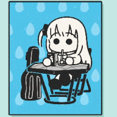

### Hi there / 你好 / こんにちは :wave: 

Welcome to my GitHub profile ~ OwO ~

This is **Yunlong (Yolo) Tang** ( 唐&nbsp;云龙 | táng yún lóng | たーん ゆいん ろーん ). 
- :mortar_board: I'm an incoming CS Ph.D. student at the [University of Rochester](https://www.rochester.edu/) (UR) in 2023 Fall.
- :school: I obtained my Bachelor degree from the [Southern University of Science and Technology](https://www.sustech.edu.cn/en/) (SUSTech).
- :dart: My research interests include **Video Understanding** and **Vision-Language Multimodal Learning**.
- :video_game: As a Tech Otaku, I love anime and video games. <code></code><code></code><code></code><code></code> and _ジョジョの奇妙な冒険_ are my favorites.
- :stuck_out_tongue_winking_eye: Fun fact: my nickname YOLO is the soramimi of _Yunlong_. Similarly in my ID `yunlong10`: Tang → Ten → 10.
<!--
<b>Languages and Tools</b>

> Life is short，you need Python.
    

-->
