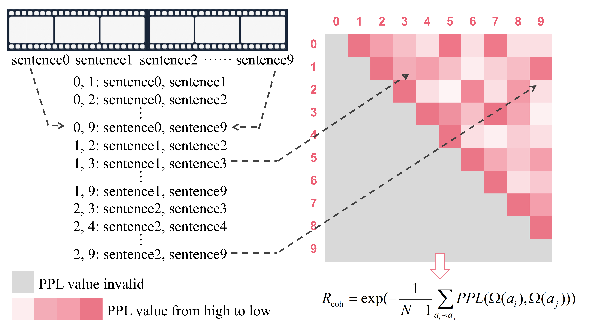

### Hi there / 你好 / こんにちは 👋 

Welcome to my GitHub profile ~ OwO ~

This is **Yunlong Tang** ( 唐&nbsp;云龙 | táng yún lóng | たーん ゆいん ろーん ). 
- 🏫 I'm currently a final-year undergraduate at [Southern University of Science and Technology](https://www.sustech.edu.cn/en/) (SUSTech).
- 🎓 I'm an incoming CS Ph.D. student at [University of Rochester](https://www.rochester.edu/) (UR) in 2023 Fall.
- 🎯 My research interests include **Video Understanding** and **Vision-Language**.
- 🎮 As a Tech Otaku, I love anime and video games. <code></code><code></code><code></code> and _ジョジョの奇妙な冒険_ are my favorites.
- 😜 Fun fact: my nickname YOLO is the soramimi of _Yunlong_. Similarly in my ID `yunlong10`: Tang → Ten → 10.

<b>More Details</b>

     

    
<b>Achievements</b>

  
<b>Languages and Tools</b>

    
> Life is short，you need Python.
    

  
<b>Publications</b>

- *Multi-modal Segment Assemblage Network for Ad Video Editing with Importance-Coherence Reward* 
  **Yunlong Tang**, Siting Xu, Teng Wang, Qin Lin, Qinglin Lu, Feng Zheng; Proceedings of the Asian Conference on Computer Vision (ACCV), 2022, pp. 3519-3535. [[ACCV'22]](https://openaccess.thecvf.com/content/ACCV2022/html/Tang_Multi-modal_Segment_Assemblage_Network_for_Ad_Video_Editing_with_Importance-Coherence_ACCV_2022_paper.html) [[arXiv]](https://arxiv.org/abs/2209.12164v1) [[Dataset]](https://github.com/yunlong10/ads-1k) [[News]](https://mp.weixin.qq.com/s/AqWcD0V_GHvgYtgxx1tHyA)
  <table border="0">
  <tr>
    <td width="50%">
       
    </td>
    <td width="50%">
        
    </td>
  </tr>
</table>

